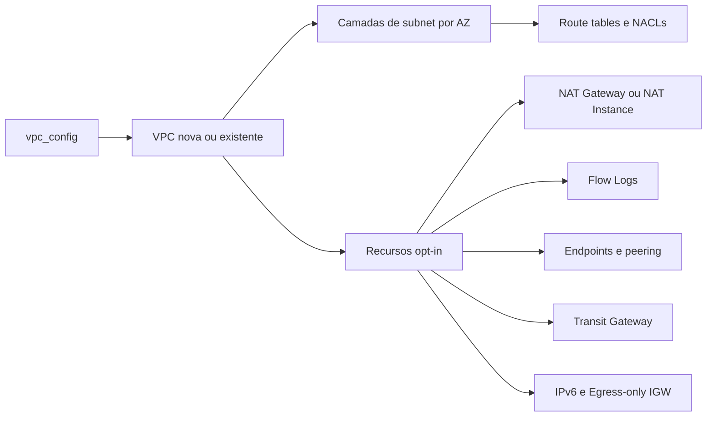

# Arquitetura

## Objetivo

O módulo transforma um único objeto `vpc_config` em uma topologia de rede AWS determinística. Ele atende tanto a criação de uma VPC quanto a composição de recursos suportados sobre uma VPC existente, sem configurar provider ou backend.

## Decisões principais

### Um contrato de entrada

`variables.tf` define o contrato tipado. Campos opcionais têm defaults no próprio tipo; combinações inválidas são rejeitadas por validations antes do acesso à AWS. A referência completa está em [CONFIGURATION.md](CONFIGURATION.md).

### VPC nova e VPC existente

- `vpc.create = true`: o módulo cria a VPC e pode gerenciar seus recursos padrão.
- `vpc.create = false`: `vpc_id` é obrigatório e a VPC é consultada para fornecer CIDR e ARN aos recursos compatíveis.

Recursos default da VPC, como default Security Group, default route table e default NACL, só são alterados quando a VPC é criada pelo módulo.

### Camadas e endereçamento determinístico

Cada item de `subnet_layers` representa uma camada lógica distribuída pelos Zone IDs selecionados. A chave de cada unidade segue `<layer>-<zone-id>`, evitando dependência do nome regional da AZ.

Quando o consumidor não informa CIDRs, o módulo usa `cidrsubnet` e aloca os índices pela ordem das camadas. Alterar a ordem, `az_widerange`, `netlength` ou `netnum` pode mudar endereços; essa alteração exige revisão de plan.

### Rotas e saída

- Camadas `public` recebem rota IPv4 pelo Internet Gateway.
- NAT Gateway e NAT Instance são opt-in e preferem o recurso da mesma AZ.
- No dual-stack, camadas públicas usam o Internet Gateway para `::/0`; camadas privadas usam Egress-only Internet Gateway.
- Rotas ad hoc usam prefix lists gerenciadas para agrupar os CIDRs de destino.
- Rotas de peering e Transit Gateway são geradas somente quando seus contratos completos estão presentes.

### Modelo de segurança

O default Security Group é esvaziado e a default NACL é bloqueada para a VPC criada. Cada camada recebe uma NACL própria neutra por padrão para não introduzir bloqueios stateless invisíveis; a segmentação de workload deve ser feita por Security Groups e, quando necessário, por `network_acl_rules` explícitas.

As exceções Trivy em `aws_subnet.tf` são limitadas às duas regras IPv6 neutras e documentam essa decisão. Não amplie uma supressão para o repositório inteiro.

Flow Logs são opt-in. No caminho CloudWatch gerenciado, a trust policy da role limita `SourceAccount` e `SourceArn`. Para S3, Firehose ou destinos CloudWatch já existentes, o consumidor mantém destino, criptografia, retenção e policies.

### Limites de responsabilidade

O módulo não:

- configura autenticação, provider, backend ou lock de estado;
- cria bucket S3/Firehose e policies cross-account para Flow Logs;
- cria RAM share ou aceita attachment Transit Gateway cross-account;
- mantém ou atualiza AMI de NAT Instance;
- executa failover cross-AZ de rotas de NAT Instance;
- suporta subnets exclusivamente IPv6.

## Compatibilidade e evolução

Mudanças no formato de `vpc_config`, defaults, endereços Terraform ou algoritmos de CIDR são mudanças de contrato. Elas devem incluir teste, atualização da configuração, entrada no changelog e instrução de migração. Mudanças que criam custo ou ampliam permissões continuam opt-in.
